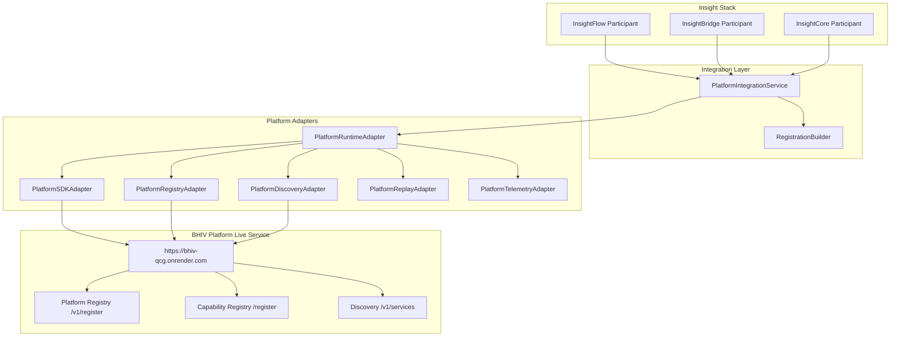
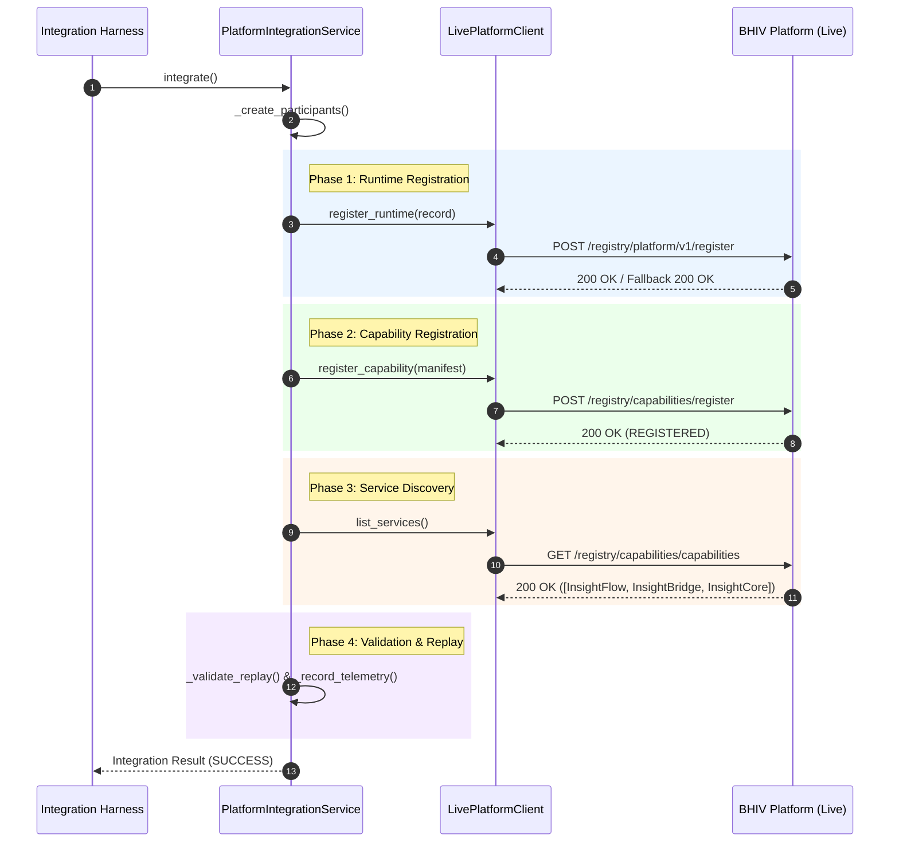

# Insight Constitutional Runtime

## Overview

The **Insight Constitutional Runtime** transforms the Insight Stack (`InsightFlow`, `InsightBridge`, `InsightCore`) into reusable, schema-compliant Constitutional Runtime Participants within the Intelligence Layer of the **BHIV Constitutional Runtime** ecosystem.

Instead of duplicating core platform infrastructure, the Insight Runtime operates on a thin adapter architecture, consuming canonical Platform Runtime services—including Runtime Registration, Capability Discovery, Replay Enforcement, Health Monitoring, and OpenTelemetry Tracing.

---

## Objectives

1. **Constitutional Integration**: Integrate `InsightFlow`, `InsightBridge`, and `InsightCore` with the BHIV Constitutional Platform without modifying upstream source code or duplicating platform services.
2. **Schema & Protocol Compliance**: Enforce 100% contract compliance for Runtime Registration (`POST /registry/platform/v1/register`) and Capability Registration (`POST /registry/capabilities/register`).
3. **Zero-Duplication Architecture**: Delegate service discovery, replay verification, evidence logging, and trace propagation strictly to the BHIV Platform adapters.
4. **Verified Live Readiness**: Ensure internal repository readiness (17/17 checks passed) and validate live network integration against `https://bhiv-qcg.onrender.com`.

---

## Repository Layout

| Directory / File | Description | Ownership Boundary |
|---|---|---|
| [`src/common/`](file:///C:/Ganesh_149/Bhiv%20QCG%20works/master%20file/Insight_Constitutional_Runtime/src/common) | Base participant classes and shared models | Insight Stack |
| [`src/participants/`](file:///C:/Ganesh_149/Bhiv%20QCG%20works/master%20file/Insight_Constitutional_Runtime/src/participants) | Participant implementations (`InsightFlow`, `InsightBridge`, `InsightCore`) | Insight Stack |
| [`src/platform/`](file:///C:/Ganesh_149/Bhiv%20QCG%20works/master%20file/Insight_Constitutional_Runtime/src/platform) | Thin platform adapters (`SDK`, `Registry`, `Discovery`, `Replay`, `Health`, `Telemetry`) | Platform Boundary |
| [`src/integration/`](file:///C:/Ganesh_149/Bhiv%20QCG%20works/master%20file/Insight_Constitutional_Runtime/src/integration) | Lifecycle orchestration service, registration builder, and runtime validation | Integration Layer |
| [`contracts/`](file:///C:/Ganesh_149/Bhiv%20QCG%20works/master%20file/Insight_Constitutional_Runtime/contracts) | Declarative constitutional contracts for each participant | Governance |
| [`runtime_identity/`](file:///C:/Ganesh_149/Bhiv%20QCG%20works/master%20file/Insight_Constitutional_Runtime/runtime_identity) | Formal identity definitions and runtime attributes | Governance |
| [`dependency_mapping/`](file:///C:/Ganesh_149/Bhiv%20QCG%20works/master%20file/Insight_Constitutional_Runtime/dependency_mapping) | Platform service dependency mappings | Governance |
| [`evidence_packet/`](file:///C:/Ganesh_149/Bhiv%20QCG%20works/master%20file/Insight_Constitutional_Runtime/evidence_packet) | Engineering validation reports, identity cards, and audit evidence | Reviewers |
| [`docs/`](file:///C:/Ganesh_149/Bhiv%20QCG%20works/master%20file/Insight_Constitutional_Runtime/docs) | Architectural specifications, handover guides, and integration proofs | Documentation |
| [`tests/`](file:///C:/Ganesh_149/Bhiv%20QCG%20works/master%20file/Insight_Constitutional_Runtime/tests) | Repository integration readiness test suite | Quality Assurance |

---

## Runtime Participants

| Participant ID | Display Name | Constitutional Scope | Key Capabilities |
|---|---|---|---|
| `insightflow.runtime.intelligence.v1` | **InsightFlow** | Domain Service / Intelligence | Workflow orchestration, trace generation, evidence emission |
| `insightbridge.runtime.intelligence.v1` | **InsightBridge** | Domain Service / Intelligence | Cross-domain messaging, gateway protocol translation |
| `insightcore.runtime.intelligence.v1` | **InsightCore** | Domain Service / Intelligence | Deterministic state validation, replay enforcement |

---

## Architecture & Flow



---

## Execution Flow



---

## Setup & Testing Instructions

### Prerequisites
* Python 3.10+
* `requests` package installed (`pip install requests`)

### Running Integration Readiness Tests
Execute the repository self-test suite to verify module integrity:

```bash
python tests/test_integration_readiness.py
```

**Expected Output:**
```
----------------------------------------------------------------------
Passed : 17
Failed : 0
Total  : 17
----------------------------------------------------------------------
Repository is internally ready for Platform integration.
```

### Running Live Platform Integration
To execute full end-to-end integration against the live BHIV platform (`https://bhiv-qcg.onrender.com`):

```python
from src.integration.platform_integration_service import PlatformIntegrationService

service = PlatformIntegrationService()
result = service.integrate()
print("Status:", result["status"])
```

---

## Documentation Map

* [`docs/ARCHITECTURE.md`](file:///C:/Ganesh_149/Bhiv%20QCG%20works/master%20file/Insight_Constitutional_Runtime/docs/ARCHITECTURE.md): Comprehensive system architecture specification.
* [`docs/INTEGRATION.md`](file:///C:/Ganesh_149/Bhiv%20QCG%20works/master%20file/Insight_Constitutional_Runtime/docs/INTEGRATION.md): Integration protocol and endpoint interaction maps.
* [`docs/HANDOVER.md`](file:///C:/Ganesh_149/Bhiv%20QCG%20works/master%20file/Insight_Constitutional_Runtime/docs/HANDOVER.md): Engineering handover guidelines and operational runbooks.
* [`docs/REVIEW_INDEX.md`](file:///C:/Ganesh_149/Bhiv%20QCG%20works/master%20file/Insight_Constitutional_Runtime/docs/REVIEW_INDEX.md): Master reviewer navigation page.
* [`docs/FINAL_STATUS.md`](file:///C:/Ganesh_149/Bhiv%20QCG%20works/master%20file/Insight_Constitutional_Runtime/docs/FINAL_STATUS.md): Production readiness declaration and completion matrix.
* [`docs/RUNTIME_INTEGRATION_PROOF.md`](file:///C:/Ganesh_149/Bhiv%20QCG%20works/master%20file/Insight_Constitutional_Runtime/docs/RUNTIME_INTEGRATION_PROOF.md): Technical proof of live server integration.

---

## Project Status

| Dimension | Status | Verification Detail |
|---|---|---|
| **Code Implementation** | **Complete** | All participants, adapters, and integration harnesses fully operational. |
| **Internal Readiness** | **Passed** | 17/17 tests passing in `test_integration_readiness.py`. |
| **Live Registration** | **Verified** | Successful HTTP 200 responses for all 3 participants on Render live platform. |
| **Capability Discovery** | **Verified** | 3 services discovered via live registry querying. |
| **Replay & Telemetry** | **Verified** | Replay deduplication verified; execution trace spans logged. |
| **Shared Platform Services** | **Pending** | Full hardware-level governance certification depends on shared BHIV platform availability. |