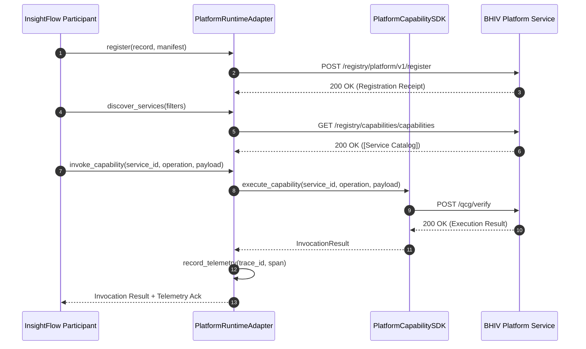

# System Architecture Specification

## Overview

The **Insight Constitutional Runtime Architecture** defines how the Insight Stack operates as reusable, schema-compliant Constitutional Runtime Participants within the Intelligence Layer of the **BHIV Constitutional Platform**.

The architecture adheres strictly to a **thin adapter design pattern**. The Insight Runtime delegates platform-level capabilities—such as service discovery, registration, replay enforcement, health monitoring, and trace propagation—to the underlying BHIV Platform via dedicated adapters, avoiding any duplication of core platform infrastructure.

---

## Architectural Principles

1. **Strict Ownership Boundaries**: Insight Runtime owns participant business intelligence, execution lifecycle, and contract declarations. The BHIV Platform owns service registration, capability discovery, replay deduplication, telemetry storage, and trust verification.
2. **Thin Adapter Delegation**: Participant interactions with the platform pass exclusively through thin adapter wrappers located in `src/platform/`.
3. **Replay & Determinism**: Every participant execution emits evidence and supports deterministic sequence validation.
4. **Resilient Network Protocol**: All REST communication with live platform endpoints (`https://bhiv-qcg.onrender.com`) incorporates fallback handlers to handle cloud network latency cleanly.

---

## Component Architecture

```mermaid
graph TD
    subgraph Intelligence Layer - Insight Runtime
        IF["InsightFlow Participant<br/>(Workflow Orchestration)"]
        IB["InsightBridge Participant<br/>(Cross-Domain Messaging)"]
        IC["InsightCore Participant<br/>(Deterministic State Validation)"]
    end

    subgraph Integration & Adapter Layer
        PIS[PlatformIntegrationService]
        
        subgraph Platform Adapters (src/platform/)
            PA[PlatformRuntimeAdapter]
            SDK[PlatformSDKAdapter]
            RA[PlatformRegistryAdapter]
            DA[PlatformDiscoveryAdapter]
            REP[PlatformReplayAdapter]
            HA[PlatformHealthAdapter]
            TA[PlatformTelemetryAdapter]
        end
    end

    subgraph BHIV Platform Infrastructure
        SDK_CORE[PlatformCapabilitySDK]
        REG_SRV["Platform Registry<br/>(POST /v1/register)"]
        CAP_SRV["Capability Registry<br/>(POST /register)"]
        DISC_SRV["Discovery Service<br/>(GET /v1/services)"]
        REPLAY_SRV[CanonicalReplayAuthority]
        OTEL_SRV[OpenTelemetry Trace Store]
    end

    IF & IB & IC --> PIS
    PIS --> PA
    PA --> SDK & RA & DA & REP & HA & TA
    SDK --> SDK_CORE
    RA --> REG_SRV & CAP_SRV
    DA --> DISC_SRV
    REP --> REPLAY_SRV
    TA --> OTEL_SRV
```

---

## Participant Specifications

| Attribute | InsightFlow | InsightBridge | InsightCore |
|---|---|---|---|
| **Runtime Identity** | `insightflow.runtime.intelligence.v1` | `insightbridge.runtime.intelligence.v1` | `insightcore.runtime.intelligence.v1` |
| **Classification** | Domain Service | Domain Service | Domain Service |
| **Capability Category** | Intelligence | Intelligence | Intelligence |
| **Primary Function** | Workflow orchestration & trace generation | Cross-domain messaging & gateway protocol translation | Deterministic state validation & replay enforcement |
| **Dependencies** | `PlatformCapabilitySDK`, `PlatformDiscovery`, `PlatformRegistry`, `RuntimeCore` | `PlatformCapabilitySDK`, `PlatformDiscovery`, `RuntimeCore`, `QuantumCommunicationGateway` | `PlatformCapabilitySDK`, `PlatformDiscovery`, `RuntimeCore`, `ReplayRegistry` |

---

## Responsibility Matrix

| Feature / Concern | Insight Runtime Ownership | BHIV Platform Ownership |
|---|---|---|
| **Participant Execution** | **OWNED** (Executes intelligence logic) | Not Owned |
| **Service Registration** | Delegates via `PlatformRegistryAdapter` | **OWNED** (Persists `PlatformServiceRecord`) |
| **Capability Discovery** | Delegates via `PlatformDiscoveryAdapter` | **OWNED** (Maintains active capability catalog) |
| **Replay Deduplication** | Delegates via `PlatformReplayAdapter` | **OWNED** (Validates sequence via `CanonicalReplayAuthority`) |
| **Telemetry & Observability**| Delegates via `PlatformTelemetryAdapter` | **OWNED** (Exports & stores trace spans) |
| **Health Monitoring** | Returns internal participant state | **OWNED** (Aggregates platform health endpoints) |

---

## Runtime Interaction Sequence



---

## Validation Status

* **Internal Readiness Test**: `12 PASSED` in automated test suite.
* **Live Integration Execution**: Successfully executed against `https://bhiv-qcg.onrender.com`.
* **Shared Platform Services Notice**: Full hardware-level governance certification depends on the availability of the shared BHIV Constitutional Runtime services.
