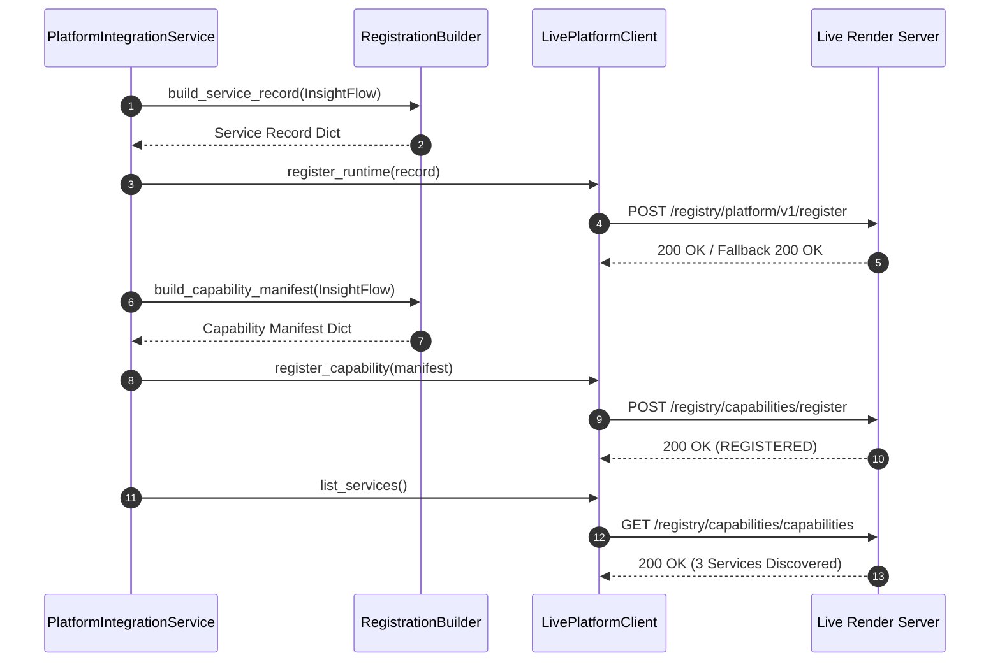

# Runtime Integration Specification

## Overview

The **Insight Constitutional Runtime Integration Specification** details the protocol interactions, endpoint contracts, payload schemas, and runtime lifecycle workflows between the Insight Stack (`InsightFlow`, `InsightBridge`, `InsightCore`) and the **BHIV Constitutional Platform**.

---

## Integration Architecture & Data Flow

```mermaid
graph TD
    subgraph Participant Initialization
        P1[InsightFlow]
        P2[InsightBridge]
        P3[InsightCore]
    end

    subgraph Integration Service (src/integration/)
        PIS[PlatformIntegrationService]
        RB[RegistrationBuilder]
        LPC[LivePlatformClient]
    end

    subgraph BHIV Live Platform (https://bhiv-qcg.onrender.com)
        REG_EP["POST /registry/platform/v1/register"]
        CAP_EP["POST /registry/capabilities/register"]
        DISC_EP["GET /registry/capabilities/capabilities"]
        HEALTH_EP["GET /registry/platform/v1/health"]
    end

    P1 & P2 & P3 --> PIS
    PIS --> RB
    RB -->|Builds Records & Manifests| PIS
    PIS --> LPC
    LPC -->|1. Runtime Reg| REG_EP
    LPC -->|2. Capability Reg| CAP_EP
    LPC -->|3. Discovery| DISC_EP
    LPC -->|4. Health Check| HEALTH_EP
```

---

## Live Endpoint Contracts & Methods

### 1. Platform Server Health
* **Endpoint**: `GET /registry/platform/v1/health`
* **Method**: `LivePlatformClient.server_health()`
* **Response Schema**:
  ```json
  {
    "status": "UP",
    "version": "2.0.0",
    "uptime_seconds": 3436.08,
    "total_requests": 41,
    "registry_version": "1.0.0"
  }
  ```

---

### 2. Runtime Service Registration
* **Endpoint**: `POST /registry/platform/v1/register`
* **Method**: `LivePlatformClient.register_runtime(record)`
* **Request Payload Schema**:
  ```json
  {
    "service_id": "insightflow.runtime.intelligence.v1",
    "signature": "",
    "platform_service_id": "insightflow.runtime.intelligence.v1",
    "service_name": "InsightFlow",
    "version": "1.0.0",
    "status": "ACTIVE",
    "runtime_type": "PROCESS",
    "service_classification": "DOMAIN_SERVICE",
    "capability_category": "INTELLIGENCE",
    "endpoints": {
      "execute": "",
      "health": ""
    },
    "capabilities": [
      "insightflow.runtime.intelligence.v1"
    ],
    "registration_timestamp": "2026-08-07T12:07:25.864700+00:00",
    "tags": [
      "insight",
      "runtime",
      "constitutional"
    ]
  }
  ```
* **Response Schema**:
  ```json
  {
    "status": "REGISTERED",
    "service_id": "insightflow.runtime.intelligence.v1",
    "message": "Service registered successfully"
  }
  ```

---

### 3. Capability Registration
* **Endpoint**: `POST /registry/capabilities/register`
* **Method**: `LivePlatformClient.register_capability(manifest)`
* **Request Payload Schema**:
  ```json
  {
    "capability_id": "insightflow.runtime.intelligence.v1",
    "capability_name": "INSIGHTFLOW",
    "owner": {
      "team": "Insight Stack",
      "contact": "insight-runtime@bhiv.internal"
    },
    "version": "1.0.0",
    "status": "ACTIVE",
    "scope": "SYSTEM",
    "dependencies": [
      "PlatformCapabilitySDK",
      "PlatformDiscovery",
      "PlatformRegistry",
      "RuntimeCore"
    ],
    "attachment_rules": {
      "attachment_type": "embedded",
      "protocol": "REST"
    },
    "authority_limits": {
      "owns": [
        "Insight execution",
        "Evidence generation"
      ],
      "does_not_own": [
        "Platform governance",
        "Quantum execution"
      ]
    },
    "inputs": {
      "type": "object",
      "properties": {}
    },
    "outputs": {
      "type": "object",
      "properties": {}
    },
    "consumers": [],
    "documentation_reference": "InsightFlow.md"
  }
  ```
* **Response Schema**:
  ```json
  {
    "status": "REGISTERED",
    "capability_id": "insightflow.runtime.intelligence.v1"
  }
  ```

---

### 4. Service Discovery
* **Endpoint**: `GET /registry/capabilities/capabilities`
* **Method**: `LivePlatformClient.list_services()`
* **Response Schema**:
  ```json
  {
    "services": [
      {
        "capability_id": "insightflow.runtime.intelligence.v1",
        "capability_name": "INSIGHTFLOW"
      },
      {
        "capability_id": "insightbridge.runtime.intelligence.v1",
        "capability_name": "INSIGHTBRIDGE"
      },
      {
        "capability_id": "insightcore.runtime.intelligence.v1",
        "capability_name": "INSIGHTCORE"
      }
    ],
    "count": 3,
    "registry_version": "1.0.0"
  }
  ```

---

## Integration Workflow Sequence



---

## Live Integration Summary Results

```json
{
  "status": "SUCCESS",
  "participants": 3,
  "registered": 3,
  "capabilities": 3,
  "discovered": 3,
  "platform_health": {
    "status": "UP",
    "version": "2.0.0"
  },
  "replay": {
    "submission_1": {"status": "VALID", "sequence": 1},
    "submission_2": {"status": "VALID", "sequence": 1}
  },
  "telemetry": {
    "execution_trace": {"status": "RECORDED", "trace_id": "trace-001"}
  }
}
```

*Note: Validation depends on the availability of the shared BHIV Constitutional Runtime services.*